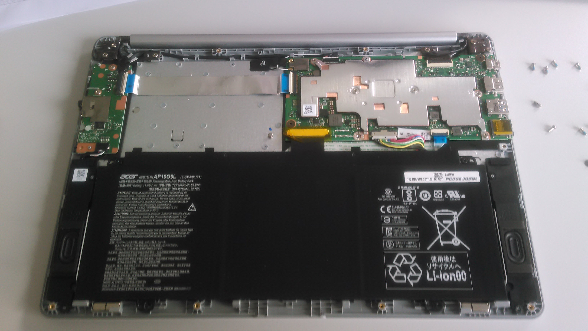

% Run upstream coreboot on an ARM Chromebook
% Paul Menzel
% October 26, 2017

# Thanks

<div class="notes">
*   Thank Philipp and organizers
*   Break might be earlier or later
*   First talk after keynote, honored.
</div>

## Who am I?

- (Economic) Mathematician by studies at [TU Berlin](https://www.tu-berlin.de/)
- Free Software enthusiast
- Active in [coreboot](https://www.coreboot.org/) since 2005 (still LinuxBIOS back then)

{ height=25% }\


- System architect at [Max Planck Institute for Molecular Genetics](https://www.molgen.mpg.de/)

# Google Chromebooks

## Architectures

1.  x86
1.  ARM
1.  MIPS

## x86

1.  Currently only Intel based devices
1.  BLOB: Intel FSP (Firmware Support Package) (formerly MRC)
1.  BLOB on co-processor Intel Management Engine
1.  BLOB: Microcode updates

## x86/Intel – Graphics driver in Linux

BLOBs required by recent Intel graphics devices:

```
$ ls /lib/firmware/i915/
bxt_dmc_ver1_07.bin        skl_dmc_ver1_23.bin
bxt_dmc_ver1.bin           skl_dmc_ver1_26.bin
bxt_guc_ver8_7.bin         skl_dmc_ver1.bin
bxt_huc_ver01_07_1398.bin  skl_guc_ver1.bin
kbl_dmc_ver1_01.bin        skl_guc_ver4.bin
kbl_dmc_ver1.bin           skl_guc_ver6_1.bin
kbl_guc_ver9_14.bin        skl_guc_ver6.bin
kbl_huc_ver02_00_1810.bin  skl_huc_ver01_07_1398.bin
```

## x86/Intel – Ecosystem

1.  More payloads in coreboot
1.  Good eco system
    1.  https://mrchromebox.tech/ – custom images
    1.  https://johnlewis.ie/ – custom images
    1.  [GalliumOS](https://galliumos.org/) – GNU/Linux distribution for x86 Chrome OS devices

## ARM

1.  [Small bootblock fused in system](https://github.com/ARM-software/arm-trusted-firmware/wiki/ARM-Trusted-Firmware-Image-Terminology#ap-boot-rom-ap_bl1)

    > AP Boot ROM: AP\_BL1
    >
    > Typically, this is the first code to execute on the AP and cannot be
    > modified. Its primary purpose is to perform the minimum intialization
    > necessary to load and authenticate an updateable AP firmware image into an
    > executable RAM location, then hand-off control to that image.

1.  No legacy, easier to set up
1.  No co-processor
1.  U-Boot, Barebox as free alternatives
1.  Bad user space situation with BLOBs for graphics drivers
1.  Few payloads
1.  No ecosystem

## Samsung Chromebook Plus (RK3399)

See thread [*Current, BLOB free laptop available Europe?*](https://mail.coreboot.org/pipermail/coreboot/2017-May/084389.html) on coreboot mailing list

- Device with Rockchip RK3399, but only available in the USA
- No BLOBs in firmware
- [Mali T860MP4 GPU](https://archlinuxarm.org/platforms/armv8/rockchip/samsung-chromebook-plus)

### Linux support

BLOBs required for

- hardware video decoding
- Wi-Fi and Bluetooth
- [GPU support](http://opensource.rock-chips.com/wiki_Graphics)

# Acer Chromebook R 13

## Specifications

-----------------------------	----------------------------
Processor                       Mediatek MT8173C 4x 2.10 GHz
Cache                           1 MB
RAM                             4 GB LPDDR3, PC3L-12800 (1600MHz)
Format                          2in1 Convertible 	 
Display size                    33 cm (13,3")
Display                         Multi-Touch Full-HD IPS Display w/ LED backlight
Resolution                      1920 x 1080 Pixel (Full HD)
IGD:                            PowerVR GX6250
eMMC                            32 GB
Dimensions                      326 x 228 x 15,5 mm (B x T x H)
Weight                          1,49 kg
Battery time                    up to 12 hours
Capacity                        4.670 mAh
-----------------------------	----------------------------

- On October 24th, 2017, 384 € at [notebooksbilliger.de ](https://www.notebooksbilliger.de/acer+chromebook+r13+cb5+312t+k0yk)

## BLOB status

### No BLOBs

-   Chrome EC for Embedded Controller as on all Chrome OS devices

### BLOBs

- PCM firmware in ARM Trusted Firmware
- Maybe USB C device
- Maybe ANX7688: PD + HDMI→DP converter

    > It contains a firmware that we update from the AP-FW, at boot time, which
    > is the only reason to have a driver for it in depthcharge.

    See commit 9859ac55 (anx7688: Add support for ANX7688) in Depthcharge.

## BLOB status – Linux support

- hardware video decoding
- Wi-Fi and Bluetooth
- GPU support (PowerVR GX6250)

## Google Oak

- Google Oak reference design

```
src/mainboard/google/oak/$ ls
boardid.c       gpio.h        romstage.c
board_info.txt  Kconfig       sdram_configs.c
bootblock.c     Kconfig.name  sdram_inf
chromeos.c      mainboard.c   tpm_tis.c
chromeos.fmd    Makefile.inc
devicetree.cb   memlayout.ld
src/mainboard/google/oak/$ git grep config Kconfig.name
Kconfig.name:config BOARD_GOOGLE_OAK
Kconfig.name:config BOARD_GOOGLE_ELM
Kconfig.name:config BOARD_GOOGLE_HANA
Kconfig.name:config BOARD_GOOGLE_ROWAN
```

## Google Elm

- Acer Chromebook R 13 is Google Elm variant of Google Oak

## TLDR

```
$ make crossgcc-arm crossgcc-aarch64 CPUS=160
$ make menuconfig
```

Select *Mainboard → Google Elm*, *Chipset → ChromeOS → Build for ChromeOS*, and *Payload → Depthcharge*

```
$ make
```

Copy to Chromebook, deactivate write protection.

```
$ flashrom -p internal -w coreboot.rom
```

## Libettereboot

New build system for Libreboot written by Paul K. with improvement patches.

```
$ git clone https://git.code.paulk.fr/libettereboot.git
$ cd libettereboot
$ for project in coreboot \
    depthcharge \
    vboot \
    arm-trusted-firmware
do
    ./libreboot download "$project"
done
$ cd sources/arm-trusted-firmware
$ git revert HEAD
$ cd ..
$ ./libreboot cook coreboot depthcharge elm
```

## Board status

- TODO: Upload to board status repository
- `git clone https://review.coreboot.org/board-status`
- Currently empty

    ```
    $ ls google/
    butterfly  link     parrot  slippy
    falco      panther  peppy   stout
    ```

# Longer version

## Developer mode and write protection

### Developer mode

1.  Key combination
2.  Ctrl + d
3.  Data is deleted

Now type `shell` in Crosh Shell to get GNU Bash.

### Write protection

1.  Open device
2.  Remove screw

## Opened device



## Look at shipped image

```
$ cbfstool cb.rom print
cb.rom: 1024 kB, bootblocksize 4, romsize 1048576, …
alignment: 64 bytes, architecture: unknown

Name               Offset     Type         Size
cbfs master header 0x20000    cbfs header  32
fallback/romstage  0x20080    stage        31797
fallback/ramstage  0x27d00    stage        39764
config             0x318c0    raw          382
revision           0x31a80    raw          560
fallback/bl31      0x31d00    stage        14947
fallback/verstage  0x357c0    stage        33894
locale_it.bin      0x3dc80    raw          9384 (…
[…]
```

## Look at shipped image cont.

```
[…]
vbgfx.bin          0x457c0    raw          21564 (…
[…]
locales            0x9f400    raw          141 (166 …
[…]
fallback/payload   0xc6a40    payload      86965
u-boot.dtb         0xdbe40    mrc_cache    2964
(empty)            0xdca40    null         144728
header pointer     0xfffc0    cbfs header  4
```

## Components

1. Chrome OS verified boot: Vboot
2. [ARM Trusted Firmware](https://github.com/ARM-software/arm-trusted-firmware)

## Vboot

1.  Very good documentation in `Documentation/Intel/vboot.html`

Four sections needed for Vboot.

1.  Read-only section
1.  Google Binary Blob (GBB) area
1.  Read/write section A
1.  Read/write section B

RO section contains CBFS with required pieces for system recovery.

## ARM Trusted Firmware

> ARM Trusted Firmware provides a reference implementation of secure
> world software for ARMv8-A, including a Secure Monitor executing at
> Exception Level 3 (EL3). It implements various ARM interface
> standards, such as:
>
> *   The Power State Coordination Interface (PSCI)
> *   Trusted Board Boot Requirements (TBBR, ARM DEN0006C-1)
> *   SMC Calling Convention
> *   System Control and Management Interface
>
> As far as possible the code is designed for reuse or porting to other
> ARMv8-A model and hardware platforms.
>
> ARM will continue development in collaboration with interested parties
> to provide a full reference implementation of Secure Monitor code and
> ARM standards to the benefit of all developers working with ARMv8-A
> TrustZone technology.

## License

- BSD-3-Clause

## Firmware in ARM TF on MT8173

Libettereboot lists the BLOBs below.

```
$ more projects/arm-trusted-firmware/configs/blobs
plat/mediatek/mt8173/drivers/spm/spm_hotplug.c
plat/mediatek/mt8173/drivers/spm/spm_mcdi.c
plat/mediatek/mt8173/drivers/spm/spm_suspend.c
plat/rockchip/rk3368/drivers/ddr/rk3368_ddr_reg_…
```

## Firmware System Power Manager (SPM) in MT8173

See `plat/mediatek/mt8173/drivers/spm/spm_hotplug.c`.

> System Power Manager (SPM) is a hardware module, which controls cpu or
> system power for different power scenarios using different firmware.
> This driver controls the cpu power in cpu hotplug flow.

```
[…]
/**********************************************************
 * PCM sequence for CPU hotplug
 **********************************************************/
static const unsigned int hotplug_binary[] = {
        0x1900001f, 0x1020020c, 0x1950001f, 0x1020020c, 0xa9400005, 0x00000001,
        0xe1000005, 0x1910001f, 0x10006720, 0x814c9001, 0xd82000e5, 0x17c07c1f,
[…]
```

## spm\_mcdi.c

> System Power Manager (SPM) is a hardware module, which controls cpu or
> system power for different power scenarios using different firmware.
> This driver controls the cpu power in cpu idle power saving state.

```
[…]
static const unsigned int mcdi_binary[] = {
        0x1a10001f, 0x10006b04, 0x1890001f, 0x10006b6c, 0x1a40001f, 0x10006210,
        0x18d0001f, 0x10006210, 0x81002001, 0xd82001c4, 0x17c07c1f, 0xa0900402,
[…]
```

## spm\_suspend.c

> System Power Manager (SPM) is a hardware module, which controls cpu or
> system power for different power scenarios using different firmware.
> This driver controls the system power in system suspend flow.

```
[…]
/**********************************************************
 * PCM sequence for cpu suspend
 **********************************************************/
static const unsigned int suspend_binary_ca7[] = {
        0x81f58407, 0x81f68407, 0x803a0400, 0x803a8400, 0x1b80001f, 0x20000000,
        0x80300400, 0x80318400, 0x80328400, 0xa1d28407, 0x81f20407, 0x81009801,
[…]
```

## Operating system

1.  Chrome OS
2.  Arch Linux
3.  Debian GNU/Linux

## Chrome OS

- Ships Linux 3.18
- Boot in 10 seconds with shipped firmware

## Depthcharge

- Configure default boot

## FMAP regions and fallback

- Goal: Similar setup to shipped image with fallback

# Questions?
